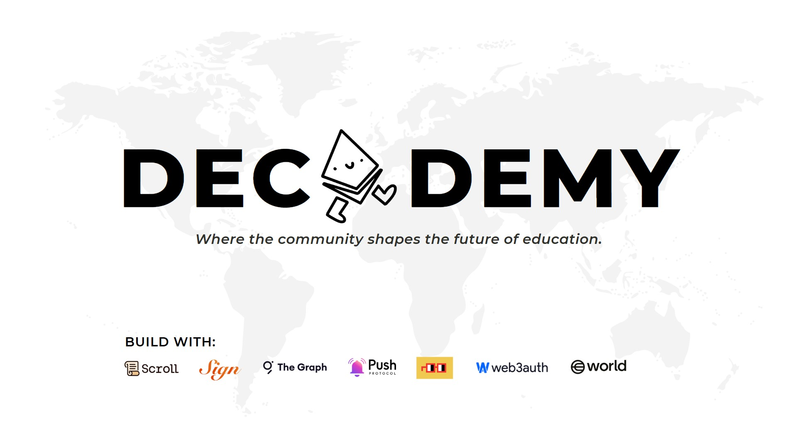

# Decademy 

A community-driven academy where people define the trends for education. <br>

 <br>

Decademy is a **community-driven**, decentralized learning platform that gives learners the power to *vote* on the topics they want to study, while enabling educators to *create content* based on community's need and preference.

![Next.js][Next.js] ![Solidity][Solidity]

Built at [**ETHGlobal Bangkok**](https://ethglobal.com/events/bangkok)

## On-chain Deployments
### Scroll Spolia Testnet
```
GraphTest.sol
	CA.: 0x6035e2454476c9E595DDaABaF97b64eDEDe8eE50
	BE.: https://sepolia.scrollscan.com/address/0x6035e2454476c9e595ddaabaf97b64edede8ee50

TopicAttestorRelayer.sol
	CA.: 0x6C95A0aB02c094B5b409c30EB1b9Dcaede8ff625
	BE.: https://sepolia.scrollscan.com/address/0x6c95a0ab02c094b5b409c30eb1b9dcaede8ff625
```
*`CA. = Contract Address`* <br>
*`BE. = Block Explorer`*

### Sign Protocol Testnet
```
SchemaId: 0x6b
Link: https://testnet-scan.sign.global/schema/onchain_evm_534351_0x6b
```

### Contributors

- [eesuhn](https://github.com/eesuhn)
- [wilson](https://github.com/0EFB6)
- [lewis](https://github.com/lewislee42)
- [samuel](https://github.com/samueltingg)
- [lucas](https://github.com/imsolucas)

<!-- LINKS -->

[Next.js]: https://img.shields.io/badge/next.js-000000?style=for-the-badge&logo=nextdotjs&logoColor=white
[Solidity]: https://img.shields.io/badge/solidity-363636?style=for-the-badge&logo=solidity&logoColor=white
